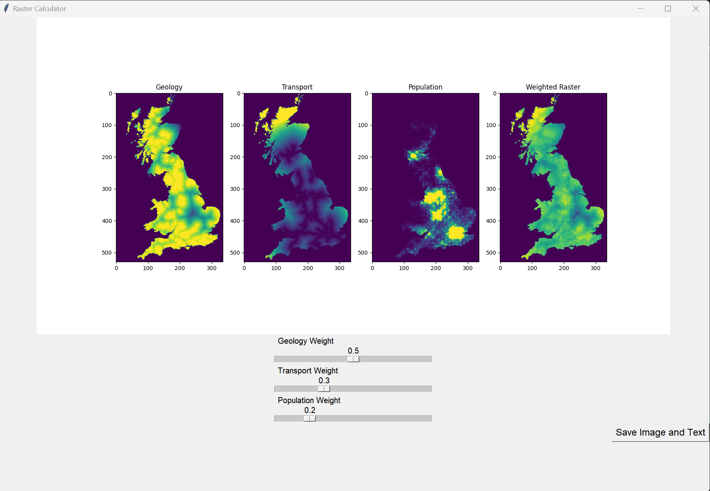

# Site suitability

## Table of Contents

- [Introduction](#introduction)
- [Functions](#functions)
- [File description](#File-description)
- [Installation](#installation)
- [Usage](#usage)
- [Function Description](#function-Description)
- [Important features and advantages of the software](#important-features-and-advantages-of-the-software)
- [License](#license)

## Introduction
This is a GUI application called **"Raster Calculator"**. The intended use of this software is to help a company producing rock aggregates in the UK when exploring suitable plant locations. The program takes into account three factors (geological data, traffic data and demographic data), each represented by a two-dimensional raster data set.

The user adjusts the weights of the defined factors using three sliders, and the weighted factors are summed and combined to produce an overall suitability map, which is then displayed to the user. The higher the value, the higher the suitability of the factor for that location. It is hoped that by calculating and visualising the results, the software will help the company to determine the final location for the plant.

In addition, the software may also be used by urban planners, land developers, environmental scientists and GIS (Geographic Information System) professionals to assist them in making decisions about land use and planning for a particular area.

## Functions
 **1. Read raster data and display them.** 
 The program can read three 2D raster data, in this case **geological, traffic and population** data. 
 
It is of course possible to add or change the raster data to suit different project requirements. The data is stored in **text files**, each in a row-major format. The program is run by reading these files and storing them in a two-dimensional list of lists. The program then visualises the raster data by displaying it graphically in the user interface.

 **2. Assign separate weighting factors to the raster data and calculate the weighted sum, rescaling the result to the range [0, 255].**
 The program provides the user with the autonomy to choose the weights for each raster. The program then adds up the three rasters multiplied by the weighting factor to produce a weighted raster. It is important to note that the sum of the three weighting factors is capped at 1. 

The program rescales the pixel values in the weighted raster each time it is weighted by a set mathematical operation, i.e. dividing the pixel values in the weighted raster by the maximum pixel value and multiplying by 255 to ensure that they always fall within the [0, 255] range.

 **3. Displaying the generated raster and writing it to a file.**
 The calculated weighted raster is displayed graphically on the canvas, allowing the user to visually determine the relative suitability of each pixel point. In addition, the program supports the loading of the generated raster data into a text file, which can be downloaded to a path of your choice for subsequent analysis.

**4. Provide a GUI that allows the user to select weights and display the results via a slider.**
In the GUI of this program, the user can select the weight of each raster by dragging the slider according to their needs and then the program will recalculate the weighted raster. The user can see the final weighted raster in the GUI and can save the image locally.

In summary, the program provides a convenient interface that allows the user to easily select weights for the raster data and then generate a weighted raster based on these weights and display it. The generated raster can then be used for subsequent spatial analysis and decision making.

## File description

**site.py**： the main body of the application, containing Tkinter, matplotlib's main loop and the GUI.

- total_raster: Add the weighted rasters together.

- rescaled_raster: Rescale the resulting raster to have values in the range [0, 255].

- plot: Plot the loaded raster on the canvas.

- update_weights: Calculates a new raster based on the update weights of each raster and updates the canvas display accordingly.

- save_image: Save the raster results to the specified path.

**io.py** :contains functions to read and write raster data.

- read_data: Reads txt data from the local path and stores the data in a list.

- write_data: writes the required raster data line by line in the address.

**calculate.py** : Contains the functions required by the program to perform raster calculations.

- multiply_raster: multiplies each cell in the raster by a set weighting factor and returns a new Raster.

- add_rasters: adds the corresponding cells to the Raster list and returns a new Raster list.

**Test_function.py**: Contains the unit tests for the Raster class.

- requirements.txt : Contains the packages required by the application.

**README.md** : Project related documentation.


## Installation

The software is written in Python, so you will need to have Python 3.7 or higher installed on your computer. You can get the latest version of python directly from the official website, the official link is [https://www.python.org/downloads/.](https://www.python.org/downloads/.)

If you already have the software on your computer, you can check the Python version by opening a terminal window and typing Python to determine if you need to update it.

Next, you can install the dependencies tkinter and matplotlib required for this program onto your computer using the following command:
```sh
 pip install -r GeoPy.txt
```

## Usage
**Preparing data for input**
- According to the company's requirements, before running the software, the user needs to prepare three 2D raster data sets in text file format, in this case **Geology.txt**, **Transport.txt**, **Population.txt**. The raster dataset should be arranged in row priority order, with each row representing a row in the raster and a higher value of the result indicating a higher suitability for that area. Users can select their own software to open the raster files and select the files to be processed, depending on the actual situation.

**Open and run the software**
- Once the raster dataset is available, the user runs the software by opening the command line and navigating to the root directory of the project and typing: `python site.py.`

**Select weighting factors for raster data**
- The GUI interface is defined using tkinter and consists of a window and three sliders that show the image in a simple way.

**Calculating new raster data**
- At the same time, the program will call the update_weights() function to recalculate the new raster data and rescale it to within the range 0 to 255. The image is then displayed on the canvas using matplotlib.

**Saving results to a file**
- When the user clicks on the "Save image and text" button, the save_result_image() function will be called to save the results as a PNG image and TXT text, the storage path can be defined by the user.

**Running interface**
- The following is the interface when the program is loaded normally:


## Function Description

`read_raster_data():`
Function reads raster data from a file and stores it in a two-dimensional list. multiply_raster(raster, weight) function multiplies each element of the raster by a set weight factor and stores the result in a two-dimensional list.

`add_rasters():`
Adds the elements of the three rasters row by row and stores the result in a two-dimensional list.

`rescale_raster():`
Function scales the values of a raster to the specified range and stores the result in a two-dimensional list.

`calculate_result_raster():`
Function calculates the weighted sum of the three rasters and rescales the result to the [0,255] range. The resulting raster is then visualised as an image and saved to a file.

`update_weights():`
 Function updates the weighting of the three rasters based on the weighting factor set by the user when the user adjusts the slider on the GUI.

`save_result_image():`
Function saves the generated image to a file, to a path of your choice.

##  Important features and advantages of the software


- **Visualisation**: The software is simple to use and offers the user the possibility to visualise the suitability of each position. The user can also customise the calculation of the suitability level according to the different weighting settings.

- **Flexibility**: The user is free to set the weighting of each factor according to its relative importance. This helps the user to consider the combined effects of several factors at the same time and thus to better determine the optimum plant location.

- **Accuracy**: The software inputs high-resolution 2D raster data, enabling a more accurate assessment of the suitability of each location, and can be tested and simulated multiple times to ensure the accuracy and reliability of the results.

- **Scalability**: The software can be easily extended to support more factors and data sources and different data formats depending on the actual requirements, mainly through flexible profiles and parameter settings to suit different needs and environments.

- **Easy to use**: The software has a clear and intuitive user interface and a simple and easy to understand operating procedure that helps the user to quickly get started and carry out various settings and analyses.


## License

[MIT](LICENSE) © Cyy9954 Littauer
